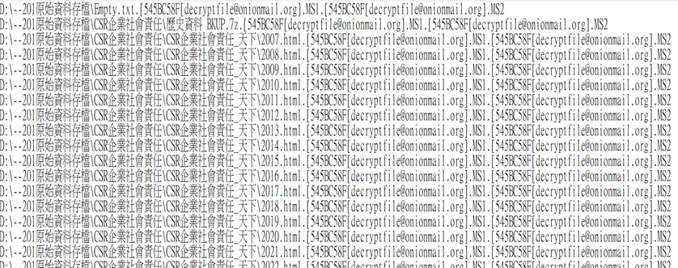

# FileMover--to-Delete/Move/Check
the project is to deal with the senario in which user want to move a lot of files from backup storage to the destination with all the file path in a .txt 

* senario: company is hacked and lots of  file is encrypted by being added gibberish suffix on file path, and now we have a list of encrypted path of files.

* example: D:\--201原始資料存檔\Empty.txt.[545BC58F[decryptfile@onionmail.org].MS1.[545BC58F[decryptfile@onionmail.org].MS2
* 

* requirement: to design a program 
  1. to delete all all the encrypted files on the list 
  2. to remove the excrypted pattern 
  3. to change the path prefix to get the back up file source path (ex: E:\--201原始資料存檔\Empty.txt)
  4. to appoint the destination to store the file (ex: D:\\ )
  5. to check whether file are moved successfully, and  come out a csv as a report to let user know  which file success and which file fail. 
